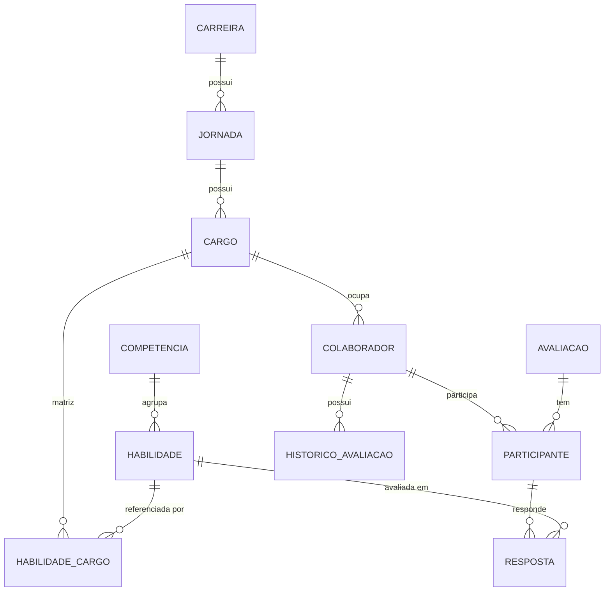

# Modelo de dados do SGC

Este documento descreve, em linguagem simples, todas as entidades de dados do
Sistema de Gestão de Carreiras. Ele é a versão legível de
[`src/data/schema.ts`](../src/data/schema.ts), que é a versão mecânica (código
TypeScript) da mesma fonte de verdade.

**Regra de ouro:** todo dado que aparece em qualquer tela deve vir de
`src/app/data/mockData.ts`, tipado pelas interfaces deste documento. Nenhuma
tela pode inventar sua própria cópia de uma entidade. Ver
`.claude/rules/06-integridade-de-dados.md`.

Convenção usada abaixo: **FK →** indica que o campo é uma referência ao `id`
de outra entidade.

---

## Carreira

Uma área profissional ampla (ex: "Tecnologia da Informação", "Recursos
Humanos"). É o nível mais alto da hierarquia de carreira.

| Campo | Significado |
|---|---|
| `id` | Identificador único |
| `nome` | Nome da carreira |
| `jornadas` | Quantidade de jornadas dessa carreira. **Sempre recalcular** (`jornadasData.filter`), nunca ler este campo diretamente |
| `status` | `Ativa` ou `Desativada` |

**Relações:** uma Carreira tem várias Jornadas (`Jornada.carreiraId`).

**Usado em:** `CarreiraDetalhePage`, `CriarJornadaPage`, `EditarJornadaPage`, tela de listagem de Carreiras (via `ContentArea` — ver divergência #2 no diagnóstico).

---

## Jornada

Uma trilha de carreira dentro de uma Carreira (ex: "Desenvolvedor",
"Gerente de Tecnologia"). Agrupa uma sequência de Cargos em ordem de evolução.

| Campo | Significado |
|---|---|
| `id` | Identificador único |
| `carreiraId` | FK → Carreira |
| `nome` | Nome da jornada |
| `carreira` | Cópia do nome da carreira (nunca usar como fonte — buscar em `carreirasData`) |
| `tipo` | `Contribuidor Individual` ou `Gestão` |
| `quantidadeCargos` | Quantidade de cargos da jornada. **Sempre recalcular** ao exibir (exceção documentada — campo pode ser escrito, mas leitura na tela é sempre via `cargosData.filter`) |
| `status` | `Ativa` ou `Desativada` |

**Relações:** pertence a uma Carreira; tem vários Cargos (`Cargo.jornadaId`).

**Usado em:** `CarreiraDetalhePage`, `CriarJornadaPage`, `EditarJornadaPage`, `JornadaDetalhePage`.

---

## Cargo

Uma posição específica dentro de uma Jornada (ex: "Desenvolvedor Júnior",
"Tech Lead"), em uma posição ordinal (`ordem`) na progressão da jornada.

| Campo | Significado |
|---|---|
| `id` | Identificador único |
| `jornadaId` | FK → Jornada |
| `cargoRM` | Nome do cargo (como cadastrado no RM/RH) |
| `ordem` | Posição do cargo dentro da jornada (`'1'`, `'2'`, ...) |
| `habilidadesConfiguradas` | Quantas habilidades da Matriz já têm nível definido para este cargo (campo armazenado — exceção documentada, sincronizado por `atualizarHabilidadesCargo`) |
| `totalHabilidades` | Hoje sempre igual a `habilidadesConfiguradas` nos dados atuais |
| `status` | Sempre `'Configurado'` nos dados atuais |

**Relações:** pertence a uma Jornada; tem várias linhas de HabilidadeCargo (a
Matriz); Colaboradores apontam para um Cargo.

**Usado em:** `JornadaDetalhePage` (Matriz), `CriarJornadaPage`, `EditarJornadaPage`, `ConfigurarCargoPage`, `ConfigurarHabilidadesCargo`, `PerfilColaboradorPage`, Dashboard.

---

## HabilidadeCargo (linha da Matriz de Habilidades)

Cada linha representa "este Cargo espera este nível desta Habilidade". É o
conteúdo da Matriz de Habilidades por cargo.

| Campo | Significado |
|---|---|
| `cargoId` | FK → Cargo |
| `habilidadeId` | FK → Habilidade |
| `nivelEsperado` | Nome do nível esperado (ver seção **Nível** abaixo — cuidado com as duas escalas) |
| `obrigatoria` | Se a habilidade é obrigatória para o cargo |

**Distinção importante (ver `.claude/rules/06`):** uma célula da Matriz sem
nenhuma linha aqui = "Não configurado" (RH ainda não decidiu). Uma célula com
`nivelEsperado: 'not_required'` (valor especial tratado na tela, não uma linha
desta tabela) = "Não exigido", decisão explícita do RH. São conceitos
diferentes.

**Usado em:** `JornadaDetalhePage` (Matriz), `ConfigurarHabilidadesCargo`, cálculo de cobertura (`utils/cobertura.ts`), Dashboard.

---

## Colaborador

Uma pessoa da empresa, ocupando um Cargo.

| Campo | Significado |
|---|---|
| `id` | Identificador único |
| `nome` | Nome do colaborador |
| `cargo` | Cópia do nome do cargo (nunca usar como fonte — buscar em `cargosData` por `cargoId`) |
| `cargoId` | FK → Cargo |
| `jornadaId` | FK → Jornada (redundante com `cargoId`, armazenado separadamente) |
| `carreiraId` | FK → Carreira (redundante com `cargoId`, armazenado separadamente) |
| `gerencia` | Texto livre — **não é** referência a Carreira/Jornada, é um rótulo de área organizacional independente |
| `ultimoAcesso` | Data por extenso em português (texto livre) |
| `status` | Sempre `'Ativo'` nos dados atuais |
| `atualizacaoDisponivel` | Se há uma nova versão de perfil disponível para sincronizar |
| `tempoNoCargo` | Texto livre, ex: "1 ano e 6 meses" |
| `ultimaAvaliacao` | Data por extenso ou vazio/ausente — sem formato garantido |

**Relações:** ocupa um Cargo; participa de várias Avaliações
(`ParticipanteAvaliacao.colaboradorId`).

**Atenção:** `gerencia` é texto livre com valores reais que **não** batem com
a lista fixa hoje hardcoded em `NovaAvaliacaoDrawer`/`EditarAvaliacaoModal`
(ver diagnóstico #3) — a lista correta de gerências deve sempre ser derivada
de `colaboradoresData`, nunca mantida como constante separada.

**Usado em:** praticamente todas as telas (Perfis, Dashboard, Avaliações, Carreiras/Matriz, telas do Colaborador).

---

## Avaliação

Uma rodada de autoavaliação de habilidades, direcionada a um público (hoje
sempre uma gerência).

| Campo | Significado |
|---|---|
| `id` | Identificador único |
| `nome` | Nome da avaliação |
| `tipo` | Sempre `'Autoavaliação'` (único tipo no MVP) |
| `status` | `Rascunho`, `Ativa` ou `Encerrada` |
| `periodoInicio` / `periodoFim` | Datas `YYYY-MM-DD` |
| `publicoLabel` | Texto livre descrevendo o público-alvo (ex: "Gerência Tecnologia") — não é uma FK |
| `descricao` | Opcional |
| `habilidades` | Lista de FK → Habilidade, avaliadas nesta rodada |
| `participantes` | Lista de Participante (abaixo) |

**Regra de negócio:** Rascunho nunca é visível ao colaborador, independente do
estado (`.claude/rules/04-regras-negocio.md`).

**Usado em:** `AvaliacaoDetalhePage`, `MinhasAvaliacoes`, `RespostaAvaliacao`, `ResultadoAvaliacao`, Dashboard. A tela de listagem de Avaliações do Admin (via `ContentArea`) hoje **não** usa esta fonte — ver divergência crítica #1 no diagnóstico.

### Participante (dentro de Avaliação)

| Campo | Significado |
|---|---|
| `colaboradorId` | FK → Colaborador |
| `status` | `Não iniciada`, `Em andamento`, `Concluída` ou `Expirada` |
| `respostas` | Lista de Resposta (abaixo) |

### Resposta (dentro de Participante)

| Campo | Significado |
|---|---|
| `habilidadeId` | FK → Habilidade |
| `nivelRespondido` | Nome do nível respondido pelo colaborador |
| `dataResposta` | Data `YYYY-MM-DD` — **único** critério válido de recência (nunca usar `periodoFim` da avaliação para decidir qual resposta é mais recente) |

---

## Histórico de Avaliação

Registro legado de avaliações (inclusive de tipo "Gestor", que não existe mais
no fluxo atual). Hoje cobre apenas 2 colaboradores (ids `1` e `2`) — não é
alimentado pelo fluxo de Avaliação atual.

| Campo | Significado |
|---|---|
| `id` | Identificador único |
| `colaboradorId` | FK → Colaborador |
| `nome` | Nome do registro |
| `tipo` | `Gestor` ou `Autoavaliação` |
| `data` | Texto livre por extenso |
| `status` | Sempre `'Concluída'` |

**Usado em:** `PerfilColaboradorPage` (aba Avaliações, histórico).

---

## Competência

Um agrupamento temático de Habilidades (ex: "Desenvolvimento Frontend",
"Liderança").

| Campo | Significado |
|---|---|
| `id` | Identificador único |
| `nome` | Nome da competência |
| `descricao` | Descrição |
| `status` | `Ativa` ou `Desativada` (hoje todas as 33 são `Ativa`) |

**Relações:** agrupa várias Habilidades (`Habilidade.competenciaId`).

**Usado em:** `HabilidadesPage`, `CompetenciaDetalhePage`, Matriz, `HabilidadesSelectionModal`.

---

## Habilidade

Uma habilidade técnica ou comportamental avaliável, associada a uma
Competência, com critérios descritos para cada um dos 5 níveis da escala que
ela usa.

| Campo | Significado |
|---|---|
| `id` | Identificador único |
| `nome` | Nome da habilidade |
| `descricao` | Descrição |
| `competencia` | Cópia do nome da competência (nunca usar como fonte) |
| `competenciaId` | FK → Competência |
| `tipo` | `Técnica` ou `Comportamental` |
| `status` | Sempre `'Ativa'` nos dados atuais |
| `niveis` | Lista de 5 critérios, um por nível: `{ nivelId, criterio }` |

**Atenção — duas escalas de nível:** a maioria das habilidades (100 de 117)
usa a escala "Básico → Intermediário → Avançado → Especialista"
(`nivelId` `'1'`–`'5'` mais `'Proficiente'`). Um grupo menor (17 habilidades,
ids 130–146, ligadas às jornadas de Engenharia/Operações/Inovação) usa a
escala alternativa "Iniciante → Aprendiz → Praticante → Experiente →
Referência" (`nivelId` `'6'`–`'10'`). As duas escalas têm o **mesmo peso
numérico** por posição — sempre comparar por peso (`getPesoFromNome`), nunca
por nome.

**Usado em:** Matriz de Habilidades, `HabilidadeDetalhePage`, `HabilidadesSelectionModal`, telas do Colaborador (Minha Carreira, Meu Perfil), Dashboard.

---

## Nível (de proficiência)

Um degrau de uma escala de proficiência. Existem 10 registros — 2 escalas
completas de 5 níveis cada — ver explicação em Habilidade acima.

| Campo | Significado |
|---|---|
| `id` | Identificador único |
| `nome` | Nome do nível (ex: "Básico", "Iniciante") |
| `descricao` | Descrição do que o nível representa |
| `peso` | Peso numérico 1–5, usado para comparar níveis entre escalas diferentes |
| `status` | Sempre `'Ativo'` |
| `emUso` | Contador de quantas vezes o nível é usado — **hoje desatualizado** para a escala alternativa e para "Proficiente" (aparecem como 0 apesar de serem usados de fato); ver diagnóstico |

**Usado em:** Matriz, `HabilidadeDetalhePage`, `DesignSystemPage`, cálculo de cobertura, cores de badge (`getCorFromPeso`).

---

## Dados exclusivos de telas de teste (`/testes/*`)

Estas quatro entidades **não** fazem parte do fluxo oficial de produto — elas
existem apenas para alimentar protótipos em `src/app/pages/testes/`. Antes de
promover qualquer uma delas para uma rota oficial, é obrigatório seguir o
protocolo de promoção (`.claude/rules/06-integridade-de-dados.md`): comparar
contra a fonte oficial, resolver divergências naquele momento, e atualizar
este documento.

### Matriz de Habilidades de João (teste)
Cópia estendida da matriz do cargo de João Silva (colaborador id `10`), usada
só nas telas de teste de "Minha Carreira" — não afeta `habilidadesCargoData`
real nem outros colaboradores.

### Histórico de Cargos de João (teste)
Histórico de progressão de cargos de João Silva. Conceito não existe hoje
para nenhum outro colaborador do sistema.

### Cargo de Benchmark (teste)
Cargos fictícios de outras áreas/empresas, usados só para a tela de teste de
benchmark de mercado. `area` e `cargoBase` são rótulos livres, não FKs.

### HabilidadeCargo de Benchmark (teste)
Matriz de habilidades dos cargos de benchmark acima.

---

## Diagrama de relações (visão simplificada)

