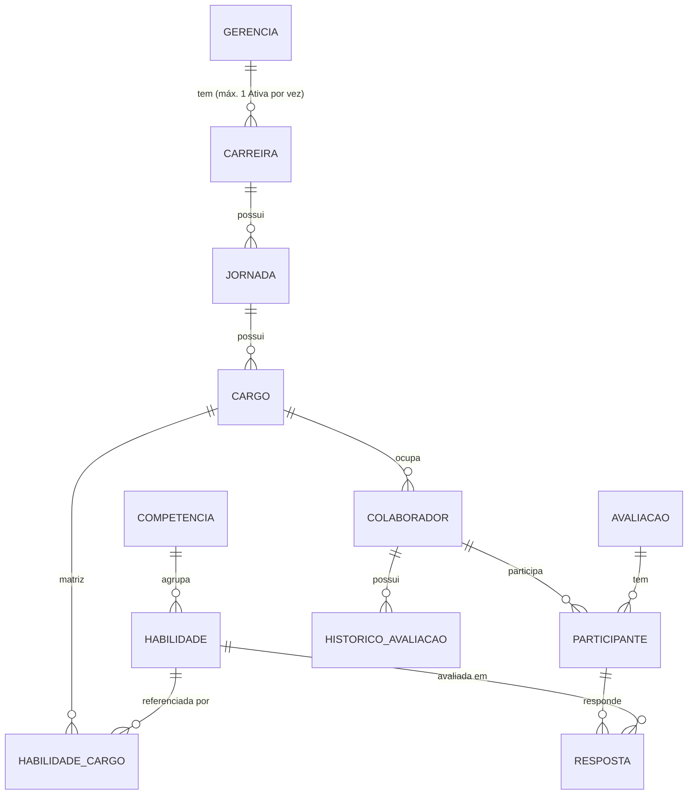

# Modelo de dados do SGC

Este documento descreve, em linguagem simples, todas as entidades de dados do
Sistema de Gestão de Carreiras. Ele é a versão legível de
[`src/data/schema.ts`](../src/data/schema.ts), que é a versão mecânica (código
TypeScript) da mesma fonte de verdade.

**Regra de ouro:** todo dado que aparece em qualquer tela deve vir de
`src/app/data/mockData.ts`, tipado pelas interfaces deste documento. Nenhuma
tela pode inventar sua própria cópia de uma entidade. Ver
`.claude/rules/06-integridade-de-dados.md`.

Convenção usada abaixo: **FK →** indica que o campo é uma referência ao `id`
de outra entidade.

---

## Changelog de auditoria

### 2026-08-28 — Módulo Carreiras (Gerência + Carreira sem nome próprio)

Auditoria direta do código atual. O que mudou nesta rodada:

- **Diagrama ER**: adicionada a relação `GERENCIA ||--o{ CARREIRA`.
- **Gerência**: `gerenciasData` (22 registros) é a **lista canônica** usada no
  cadastro de Carreira. Seção "Usado em" completada (PerfilColaboradorPage,
  FormularioAvaliacao, drawer de criação de Carreira em `ContentArea`).
- **Carreira**: "Usado em" completado (PerfilColaboradorPage). Nome de exibição
  resolvido **sempre** via `carreira.gerenciaId → gerenciasData`, nunca de
  `carreirasData` (que não tem `nome`).
- **Jornada.carreira**: corrigido o texto — a resolução do nome da carreira é
  `carreira.gerenciaId → gerenciasData`, não "buscar em `carreirasData`".
- **Bloco "Atenção" de Colaborador.gerencia**: reconciliada a contradição —
  distinção explícita entre "gerência de colaborador" (texto livre, 12 valores
  em uso, deriva de `colaboradoresData`, sem lista mestra) e "gerência para
  cadastro de Carreira" (22, lista canônica `gerenciasData`).

Handoff detalhado do módulo: `docs/HANDOFF-CARREIRAS.md`.

---

## Gerência

Unidade organizacional vinda do RM (no sistema real, cadastro externo).
É a **fonte única do nome** exibido para a Carreira vinculada.

| Campo | Significado |
|---|---|
| `id` | Identificador único (`g1`..`g22` no mock) |
| `nome` | Nome da gerência (ex: "Tecnologia", "Financeiro") |

**Sem status:** uma Gerência sempre "existe". O que pode ser
ativado/desativado é a Carreira daquela gerência, nunca a gerência em si.

**Relações:** uma Gerência tem no máximo uma Carreira `Ativa` por vez
(pode ter Carreiras `Desativada` além dela — histórico). `Carreira.gerenciaId` → Gerência.

**Mock:** 22 gerências em `gerenciasData` (`g1`..`g22`) — **lista canônica**,
única fonte válida de gerência no cadastro de Carreira. Os 12 nomes `g1`..`g12`
coincidem com os valores de texto de `Colaborador.gerencia` usados hoje, mas
**não há vínculo por id** (ver "Atenção" em Colaborador). Hoje **17 gerências
têm Carreira**; **5 não têm** (`g13` Marketing, `g14` Vendas, `g15` Jurídico,
`g16` Atendimento ao Cliente, `g17` Qualidade) — criadas de propósito para
testar o fluxo de Criar Carreira do zero.

**Usado em:** resolução do nome de Carreira em `ContentArea` (listagem de
Carreiras + drawer de criação/edição), `CarreiraDetalhePage`, `CriarJornadaPage`,
`EditarJornadaPage`, `JornadaDetalhePage`, `PerfilColaboradorPage`
(card de identificação e aba Carreira), `FormularioAvaliacao` (card de Revisão,
via `getCarreiraEJornadaNomes`), e `getCarreiraEJornadaNomes`
(`utils/avaliacoes.tsx`).

---

## Carreira

Uma área profissional ampla, sempre correspondente a uma Gerência. É o nível
mais alto da hierarquia de carreira.

| Campo | Significado |
|---|---|
| `id` | Identificador único |
| `gerenciaId` | FK → Gerência. A Carreira **não tem nome próprio**: o nome de exibição vem sempre de `gerenciasData.find(g => g.id === carreira.gerenciaId).nome` |
| `jornadas` | Quantidade de jornadas dessa carreira. **Sempre recalcular** (`jornadasData.filter`), nunca ler este campo diretamente |
| `status` | `Ativa` ou `Desativada` |

**Relações:** uma Carreira pertence a uma Gerência (`gerenciaId`) e tem
várias Jornadas (`Jornada.carreiraId`). Uma Gerência pode ter várias Carreiras
ao longo do tempo, mas **no máximo 1 `Ativa` por vez** — regra aplicada no
drawer de criação (`getCarreiraAtivaDaGerencia`, `CarreirasContext`).

**Usado em:** `CarreiraDetalhePage`, `CriarJornadaPage`, `EditarJornadaPage`,
`PerfilColaboradorPage` (via `colaborador.carreiraId`), tela de listagem de
Carreiras + drawer de criação/edição (via `ContentArea`).

---

## Jornada

Uma trilha de carreira dentro de uma Carreira (ex: "Desenvolvedor",
"Gerente de Tecnologia"). Agrupa uma sequência de Cargos em ordem de evolução.

| Campo | Significado |
|---|---|
| `id` | Identificador único |
| `carreiraId` | FK → Carreira |
| `nome` | Nome da jornada |
| `carreira` | Cópia denormalizada do nome da carreira (nunca usar como fonte). Para exibir o nome da carreira de uma jornada: `carreirasData.find(c => c.id === jornada.carreiraId)` → `gerenciasData.find(g => g.id === carreira.gerenciaId).nome`. **Nunca** ler `jornada.carreira` nem esperar um `nome` em `carreirasData` (não existe) |
| `tipo` | `Contribuidor Individual` ou `Gestão` |
| `quantidadeCargos` | Quantidade de cargos da jornada. **Sempre recalcular** ao exibir (exceção documentada — campo pode ser escrito, mas leitura na tela é sempre via `cargosData.filter`) |
| `status` | `Ativa` ou `Desativada` |

**Relações:** pertence a uma Carreira; tem vários Cargos (`Cargo.jornadaId`).

**Usado em:** `CarreiraDetalhePage`, `CriarJornadaPage`, `EditarJornadaPage`, `JornadaDetalhePage`.

---

## Cargo

Uma posição específica dentro de uma Jornada (ex: "Desenvolvedor Júnior",
"Tech Lead"), em uma posição ordinal (`ordem`) na progressão da jornada.

| Campo | Significado |
|---|---|
| `id` | Identificador único |
| `jornadaId` | FK → Jornada |
| `cargoRM` | Nome do cargo (como cadastrado no RM/RH) |
| `ordem` | Posição do cargo dentro da jornada (`'1'`, `'2'`, ...) |
| `habilidadesConfiguradas` | Quantas habilidades da Matriz já têm nível definido para este cargo (campo armazenado — exceção documentada, sincronizado por `atualizarHabilidadesCargo`) |
| `totalHabilidades` | Hoje sempre igual a `habilidadesConfiguradas` nos dados atuais |
| `status` | Sempre `'Configurado'` nos dados atuais |

**Relações:** pertence a uma Jornada; tem várias linhas de HabilidadeCargo (a
Matriz); Colaboradores apontam para um Cargo.

**Usado em:** `JornadaDetalhePage` (Matriz), `CriarJornadaPage`, `EditarJornadaPage`, `ConfigurarCargoPage`, `ConfigurarHabilidadesCargo`, `PerfilColaboradorPage`, Dashboard.

---

## HabilidadeCargo (linha da Matriz de Habilidades)

Cada linha representa "este Cargo espera este nível desta Habilidade". É o
conteúdo da Matriz de Habilidades por cargo.

| Campo | Significado |
|---|---|
| `cargoId` | FK → Cargo |
| `habilidadeId` | FK → Habilidade |
| `nivelEsperado` | Nome do nível esperado (ver seção **Nível** abaixo) |
| `obrigatoria` | Se a habilidade é obrigatória para o cargo |

**Distinção importante (ver `.claude/rules/06`):** uma célula da Matriz sem
nenhuma linha aqui = "Não configurado" (RH ainda não decidiu). Uma célula com
`nivelEsperado: 'not_required'` (valor especial tratado na tela, não uma linha
desta tabela) = "Não exigido", decisão explícita do RH. São conceitos
diferentes.

**Usado em:** `JornadaDetalhePage` (Matriz), `ConfigurarHabilidadesCargo`, cálculo de cobertura (`utils/cobertura.ts`), Dashboard.

---

## Colaborador

Uma pessoa da empresa, ocupando um Cargo.

| Campo | Significado |
|---|---|
| `id` | Identificador único |
| `nome` | Nome do colaborador |
| `cargo` | Cópia do nome do cargo (nunca usar como fonte — buscar em `cargosData` por `cargoId`) |
| `cargoId` | FK → Cargo |
| `jornadaId` | FK → Jornada (redundante com `cargoId`, armazenado separadamente) |
| `carreiraId` | FK → Carreira (redundante com `cargoId`, armazenado separadamente) |
| `gerencia` | Texto livre com o nome da gerência — **não** é FK para a entidade Gerência (os valores coincidem com 12 dos 22 `gerenciasData[].nome`, mas não há vínculo por id). Não é referência a Carreira/Jornada |
| `ultimoAcesso` | Data por extenso em português (texto livre) |
| `status` | Sempre `'Ativo'` nos dados atuais |
| `atualizacaoDisponivel` | Se há uma nova versão de perfil disponível para sincronizar |
| `tempoNoCargo` | Texto livre, ex: "1 ano e 6 meses" |
| `ultimaAvaliacao` | Data por extenso ou vazio/ausente — sem formato garantido |

**Relações:** ocupa um Cargo; participa de várias Avaliações
(`ParticipanteAvaliacao.colaboradorId`).

**Atenção — duas noções de "gerência" coexistem no sistema, propositalmente:**

1. **Gerência de colaborador** (`Colaborador.gerencia`): texto livre, **12
   valores distintos em uso**, derivado sempre de `colaboradoresData`
   (`Array.from(new Set(colaboradoresData.map(c => c.gerencia))).sort()`).
   Não há lista mestra — a lista é a projeção dos dados. Usada como filtro em
   `DashboardPage`, `Perfis`, e como público-alvo no seletor "Por Público-alvo"
   de `FormularioAvaliacao` (`SeletorGerenciaGranular`). Nunca manter como
   constante hardcoded.
2. **Gerência para cadastro de Carreira** (`Gerencia` / `gerenciasData`):
   entidade real, **22 registros**, lista canônica com `id`. É a FK de
   `Carreira.gerenciaId`. Só aparece no módulo Carreiras.

Os 12 nomes do grupo (1) coincidem com 12 dos 22 nomes do grupo (2), mas os
dois **não** estão ligados por id hoje. Unificar os dois é uma decisão
consciente de escopo adiada (ver `docs/HANDOFF-CARREIRAS.md` > Pendências),
não uma lacuna esquecida.

**Usado em:** praticamente todas as telas (Perfis, Dashboard, Avaliações, Carreiras/Matriz, telas do Colaborador).

---

## Avaliação

Uma rodada de autoavaliação de habilidades, direcionada a um público (hoje
sempre uma gerência).

| Campo | Significado |
|---|---|
| `id` | Identificador único |
| `nome` | Nome da avaliação |
| `tipo` | Sempre `'Autoavaliação'` (único tipo no MVP) |
| `status` | `Rascunho`, `Ativa` ou `Encerrada` |
| `periodoInicio` / `periodoFim` | Datas `YYYY-MM-DD` |
| `publicoLabel` | Texto livre descrevendo o público-alvo (ex: "Gerência Tecnologia") — não é uma FK |
| `descricao` | Opcional |
| `habilidades` | Lista de FK → Habilidade, avaliadas nesta rodada |
| `participantes` | Lista de Participante (abaixo) |

**Regra de negócio:** Rascunho nunca é visível ao colaborador, independente do
estado (`.claude/rules/04-regras-negocio.md`).

**Usado em:** `AvaliacaoDetalhePage`, `MinhasAvaliacoes`, `RespostaAvaliacao`, `ResultadoAvaliacao`, Dashboard. A tela de listagem de Avaliações do Admin (via `ContentArea`) hoje **não** usa esta fonte — ver divergência crítica #1 no diagnóstico.

### Participante (dentro de Avaliação)

| Campo | Significado |
|---|---|
| `colaboradorId` | FK → Colaborador |
| `status` | `Não iniciada`, `Em andamento`, `Concluída` ou `Expirada` |
| `respostas` | Lista de Resposta (abaixo) |

### Resposta (dentro de Participante)

| Campo | Significado |
|---|---|
| `habilidadeId` | FK → Habilidade |
| `nivelRespondido` | Nome do nível respondido pelo colaborador |
| `dataResposta` | Data `YYYY-MM-DD` — **único** critério válido de recência (nunca usar `periodoFim` da avaliação para decidir qual resposta é mais recente) |

---

## Histórico de Avaliação

Registro legado de avaliações (inclusive de tipo "Gestor", que não existe mais
no fluxo atual). Hoje cobre apenas 2 colaboradores (ids `1` e `2`) — não é
alimentado pelo fluxo de Avaliação atual.

| Campo | Significado |
|---|---|
| `id` | Identificador único |
| `colaboradorId` | FK → Colaborador |
| `nome` | Nome do registro |
| `tipo` | `Gestor` ou `Autoavaliação` |
| `data` | Texto livre por extenso |
| `status` | Sempre `'Concluída'` |

**Usado em:** `PerfilColaboradorPage` (aba Avaliações, histórico).

---

## Competência

Um agrupamento temático de Habilidades (ex: "Desenvolvimento Frontend",
"Liderança").

| Campo | Significado |
|---|---|
| `id` | Identificador único |
| `nome` | Nome da competência |
| `descricao` | Descrição |
| `status` | `Ativa` ou `Desativada` (hoje todas as 33 são `Ativa`) |

**Relações:** agrupa várias Habilidades (`Habilidade.competenciaId`).

**Usado em:** `HabilidadesPage`, `CompetenciaDetalhePage`, Matriz, `HabilidadesSelectionModal`.

---

## Habilidade

Uma habilidade técnica ou comportamental avaliável, associada a uma
Competência.

| Campo | Significado |
|---|---|
| `id` | Identificador único |
| `nome` | Nome da habilidade |
| `descricao` | Descrição |
| `competencia` | Cópia do nome da competência (nunca usar como fonte) |
| `competenciaId` | FK → Competência |
| `tipo` | `Técnica` ou `Comportamental` |
| `status` | Sempre `'Ativa'` nos dados atuais |
| `niveis` | Subconjunto livre de níveis escolhido pelo RH ao criar a habilidade (não precisa ser 5). Cada nível escolhido recebe um critério de texto próprio: `{ nivelId, criterio }`. Ao montar a Matriz de Habilidades por cargo, o RH escolhe o nível esperado dentre os níveis já aplicáveis desta habilidade — nunca um nível novo fora dessa lista. |

Os 5 registros de Nível (ids `'1'`–`'5'`: Aprendiz/Iniciante/Intermediário/
Avançado/Especialista) são compartilhados por todas as 117 habilidades — não
há mais divisão de escala.

**Usado em:** Matriz de Habilidades, `HabilidadeDetalhePage`, `HabilidadesSelectionModal`, telas do Colaborador (Minha Carreira, Meu Perfil), Dashboard.

---

## Nível (de proficiência)

Um degrau da escala de proficiência. Existem 5 registros, uma escala única,
fixa (sem CRUD pelo RH).

| Campo | Significado |
|---|---|
| `id` | Identificador único — **string arbitrária, NÃO indica o peso** (ver tabela abaixo) |
| `nome` | Nome do nível (Aprendiz, Iniciante, Intermediário, Avançado ou Especialista) |
| `descricao` | Descrição do que o nível representa |
| `peso` | Peso numérico 1–5, usado para comparar posição na progressão |
| `emUso` | Contador de quantas vezes o nível é usado — o valor bruto gravado no mock é decorativo; a exibição real sempre recalcula em runtime (`ContentArea.tsx`, `niveisComContagem`) a partir de `habilidadesData`, nunca lê este campo direto |

**O `id` do registro NÃO indica o peso — sempre usar o campo `peso` para
ordenação/comparação, nunca inferir por `id`.** Mapeamento real hoje
(`niveisDefaultData` em `src/app/data/mockData.ts`):

| `id` | `peso` | `nome` |
|---|---|---|
| `'1'` | 1 | Aprendiz |
| `'2'` | 2 | Iniciante |
| `'5'` | 3 | Intermediário |
| `'3'` | 4 | Avançado |
| `'4'` | 5 | Especialista |

Ou seja: `id` `'3'`, `'4'` e `'5'` estão "trocados" em relação ao peso, por
razões históricas (a consolidação das duas escalas antigas reaproveitou os
ids existentes). Para comparar níveis entre si use `peso` diretamente, ou
`getPesoFromNome(nome)` quando só tiver o nome.

A tela "Níveis de Habilidades" é consulta pura — sem busca, filtros, criação
ou edição; só lista os 5 registros fixos, sempre ordenados por `peso`
ascendente (sem ordenação clicável).

**Usado em:** Matriz, `HabilidadeDetalhePage`, `DesignSystemPage`, cálculo de cobertura, cores de badge (`getCorFromPeso`).

---

## Dados exclusivos de João Silva (Meu Perfil / Minha Carreira)

Estas duas entidades existem só para o colaborador João Silva (id `10`) — não
existe hoje equivalente para nenhum outro colaborador do sistema. Não são
dado de teste: são consumidas por rotas oficiais do Colaborador.

### JoaoHabilidadeCargoMatriz
Cópia estendida da matriz do cargo atual de João Silva (`joaoHabilidadesCargoMatriz`
em `mockData.ts`) — não afeta `habilidadesCargoData` real nem outros
colaboradores (ex: Ana Silva continua na matriz oficial do cargo).

**Usado em:** `minhaCarreiraShared.tsx` (via `matrizParaCargo`/`enriquecerMatriz`),
consumido por `MinhaCarreiraPage` e `ColaboradorView.tsx` (Meu Perfil).

### HistoricoCargoJoao
Histórico de progressão de cargos de João Silva (`historicoCargosJoaoData`
em `mockData.ts`). Conceito não existe hoje para nenhum outro colaborador do
sistema — se isso virar feature real, avaliar generalizar por `colaboradorId`.

**Usado em:** `ColaboradorView.tsx` (retrospecto "Minha Trajetória", Meu Perfil),
`MinhaCarreiraPage` (Evolução profissional).

---

## Diagrama de relações (visão simplificada)

```mermaid
erDiagram
    GERENCIA ||--o{ CARREIRA : "tem (máx. 1 Ativa por vez)"
    CARREIRA ||--o{ JORNADA : possui
    JORNADA ||--o{ CARGO : possui
    CARGO ||--o{ HABILIDADE_CARGO : "matriz"
    HABILIDADE ||--o{ HABILIDADE_CARGO : "referenciada por"
    COMPETENCIA ||--o{ HABILIDADE : agrupa
    CARGO ||--o{ COLABORADOR : ocupa
    COLABORADOR ||--o{ PARTICIPANTE : participa
    AVALIACAO ||--o{ PARTICIPANTE : tem
    PARTICIPANTE ||--o{ RESPOSTA : responde
    HABILIDADE ||--o{ RESPOSTA : "avaliada em"
    COLABORADOR ||--o{ HISTORICO_AVALIACAO : possui
```
